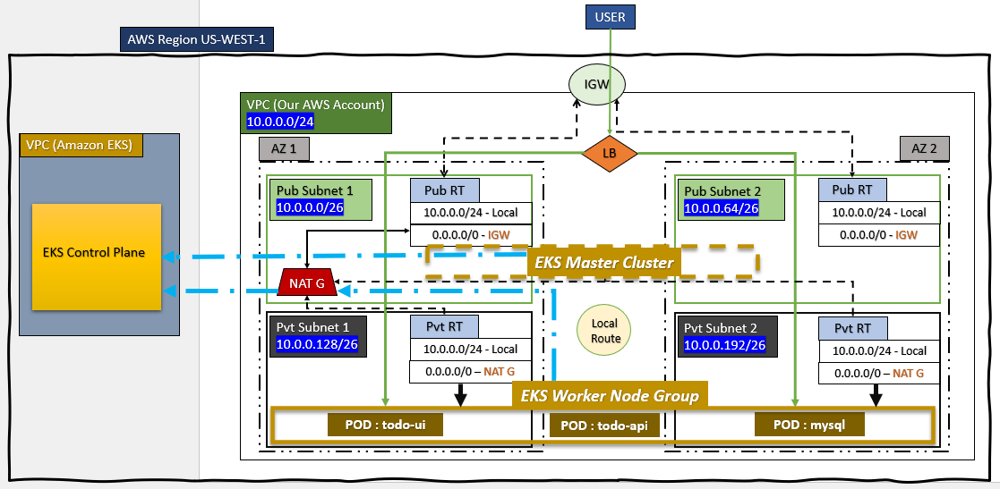
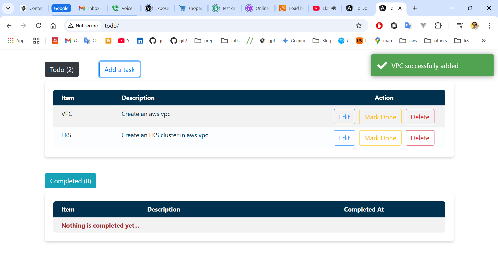

# Deploy Todo App on k8 cluster by Terraform

**Recommendations:**
- Go thought the project and run it.
- Be fearless and play with it.


### What we'll do here -

1. Set up an AWS VPC with 4 subnets in 2 Availability Zone.

2. Configure IGW and NAT Gateway with route table.

3. Create a EKS Master cluster in public subnets and Worker in Private subnets.

4. Deploy Todo app with Java API, Angular UI and MySQL as Kubernetes resource.

5. And all we'll do just running terraform script.

Finally, we'll access the app by a local domain pointing NLB's static IP

First 2 steps I already described in previous articles -

1. [AWS VPC with Terraform | Part 1 (VPC)](https://www.linkedin.com/pulse/aws-vpc-its-easier-than-you-think-hasan-jaman-nqm4c/)

2. [Setting up AWS VPC using Terraform | Part 2 (Hands-on)](https://www.linkedin.com/pulse/setting-up-aws-vpc-terraform-hasan-jaman-x1pjc/)



Previously we create the VPC, here we are going to create a AWS Elastic Kubernetes Service (EKS) cluster inside the VPC.

## Elastic Kubernetes Service (EKS)

EKS is the Managed Kubernetes service in AWS cloud provider. Although you place your EKS Master Cluster in public subnets 
in your own VPC, but actually it's not part of your VPC. Just permit **EKS Control Plane** to control/communicate your EKS 
Cluster through this way. This is why EKS called as **Managed** Kubernetes service.

EKS Control Plane is the Master which is owned by AWS itself. When you create a EKS cluster in your account, AWS connect 
it to their EKS Control Plane of that region where you create your EKS.

**EKS Worker Node Group** is kept here in private subnets which are responsible to pull images, make the deployments (pods), 
expose services assigned by EKS Control Plane.

Check **_modules/eks_** codes for EKS and its dependent on 2 IAM role which  you will find in **_modules/iam_**

## Setup the Infrastructure

Run below command in project root directory
🎯 Alert: You must change the S3 bucket name and ensure such key path is available in your own bucket in **_backent.tf_** and **_k8-resources/backend.tf_** file.

```$ terraform apply -var-file="prod.tfvars" -auto-approve```

It will setup VPC and EKS as prod environment.


## Deploy Kubernetes Resources

After setting up AWS infrastructure successfully move to k8-resources and apply -

```$ cd k8-resources```

```$ terraform apply -auto-approve```

If you check k8-resources you will find -

- create a todo namespace

- Make 3 deployments by pulling todo-service, todo-service-ui and mysql image from docker hub.

- Expose 3 services for their internal communication. Only todo-service-ui is publicly exposed by a AWS NLB. Others two are Cluster IP.
```
server {
listen 80;
server_name todo;

    location / {
        root /usr/share/nginx/html;
        index index.html;
        try_files $uri /index.html;
    }
    
    location /api/ {
        proxy_pass http://todo-service:8080;
        .
        .
        .
    }
}
```

Since in Angular UI application is using nginx proxy so any call with **/api** it will pass to http://todo-service:8080 
with adding endpoint since todo-service is the service to reach todo-api. Similarly, todo-api will connect to mysql through its service.

Since your EKS already up, and you successfully deployed k8 resources now add the EKS context in your local terminal -
```
$ aws eks --region us-west-1 update-kubeconfig --name eksdemo
```
check pods and services by -

```
$ kubectl get pods -n todo

$ kubectl get svc -n todo
```

I hope you are here after successfully deploying everything ... Now lets access the todo application with a domain. Run below command with your actual AWS NLB domain which you have seen previously while running kubectl get svc -n todo and get the static public IP
```
$ nslookup paste-your-aws-nlb-domain-url
```
Now add the IP in your **/etc/hosts** files like - **(Don't forget to paste your NLB IP)**
```
52.53.123.136 todo
```
Previously You have seen I added server_name todo; in ui image nginx configuration which means the ui application will 
serve if you in your browser by http://todo, and you will see ...



#### THE END
